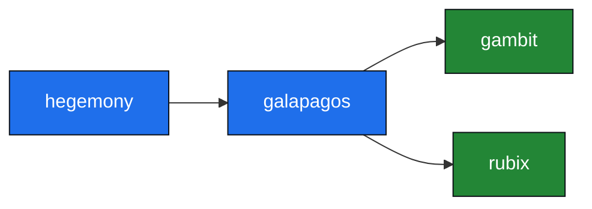

# Dan Riddell

Go developer, came up through C#/.NET. I mostly build small libraries, terminal tools and a
pile of games and simulations, and I ship them through my own Homebrew tap. A couple also run
as web apps.

<p>
  
  
  
  
  
</p>

## How the projects fit together

The libraries feed the tools and games, and a few of the games build on each other. These are the
actual `require` edges between my own Go modules:



## Projects

| Project | What it is | Tags |
| --- | --- | --- |
| [unum](https://github.com/danielriddell21/unum) | JSON, diff & hash dev toolkit | TUI · CLI · Web · 🍺 · 🐳 |
| [fiat-lux](https://github.com/danielriddell21/fiat-lux) | An AI agent dropped into an empty world with the tools of creation | TUI · CLI · Web · 🍺 · 🐳 |
| [tracearr](https://github.com/danielriddell21/tracearr) | OpenTelemetry trace middleware for the *arr stack | CLI · 🐳 |
| [galapagos](https://github.com/danielriddell21/galapagos) | Framework for watching learning algorithms evolve in real time | Lib · CLI · 🍺 |
| [factorio-mcp](https://github.com/danielriddell21/factorio-mcp) | MCP server that lets an LLM play Factorio 2.0 over RCON | CLI · 🍺 |
| [pandemonium](https://github.com/danielriddell21/pandemonium) | Procedurally generated, Wolfenstein-3D-style raycaster FPS | CLI · 🍺 |

<details>
<summary><b>Everything else…</b></summary>

| Project | What it is | Tags |
| --- | --- | --- |
| [toolshed](https://github.com/danielriddell21/toolshed) | Eleven terminal toys in one binary: fractals, sims, a maze solver | TUI · CLI · 🍺 |
| [hegemony](https://github.com/danielriddell21/hegemony) | Territory-war sim where competing algorithms fight over a grid | CLI · 🍺 |
| [vivarium](https://github.com/danielriddell21/vivarium) | 2D ecosystem where behaviour evolves through tiny neural nets | CLI · 🍺 |
| [gambit](https://github.com/danielriddell21/gambit) | Two chess engines play each other; a testbed for search strategies | Lib · CLI · 🍺 |
| [rubix](https://github.com/danielriddell21/rubix) | Rubik's cube solver, nine ways, with a LEGO Mindstorms EV3 driver | Lib · CLI · 🍺 |
| [narrata](https://github.com/danielriddell21/narrata) | Embedded, dependency-free narration runtime for Go | Lib · CLI · 🍺 |
| [retrievium](https://github.com/danielriddell21/retrievium) | Generic search algorithms behind one small interface | Lib |
| [ordinex](https://github.com/danielriddell21/ordinex) | Generic sorting algorithms behind one small interface | Lib |

</details>

<sub>Tags: TUI · CLI · Web interface · Lib (Go module) · 🍺 Homebrew · 🐳 Docker</sub>

The TUIs are built on [Bubble Tea](https://github.com/charmbracelet/bubbletea); the games and sims
run on [Ebitengine](https://ebitengine.org). Most CLIs install from my
[Homebrew tap](https://github.com/danielriddell21/homebrew-tap):

```sh
brew install danielriddell21/tap/<tool>
```

**unum** and **fiat-lux** also run as web apps at [riddellious.dev](https://riddellious.dev), which
sits on infrastructure I keep as Terraform in
[riddellious-dev](https://github.com/danielriddell21/riddellious-dev); Terraform plans get summarised
onto PRs by my [tf-plan-summary-action](https://github.com/danielriddell21/tf-plan-summary-action).

## Elsewhere

[GitHub](https://github.com/danielriddell21) · [LinkedIn](https://uk.linkedin.com/in/daniel-riddell-418795178)
